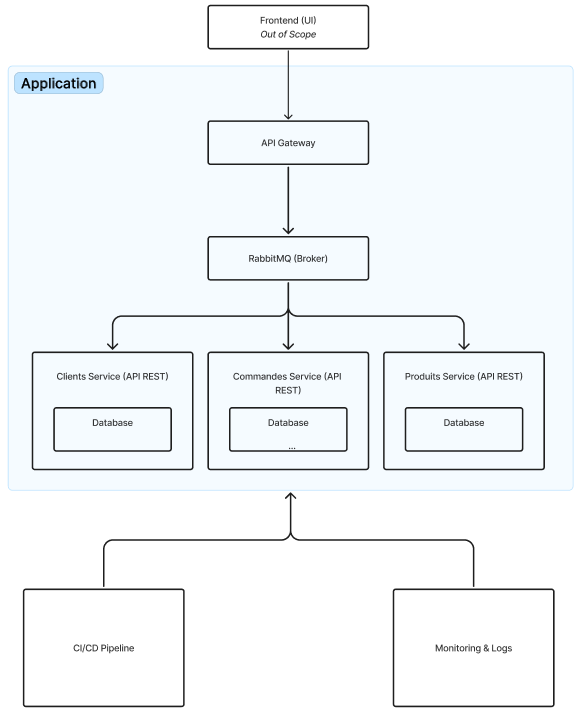

# PayeTonKawa

PayeTonKawa est une solution basée sur une architecture de microservices pour la gestion des clients, des produits et des commandes. Ce projet utilise Node.js et Express pour créer des APIs RESTful pour chaque service, avec RabbitMQ pour la gestion des messages entre services. L'ensemble est orchestré via Kubernetes et déployé sur un VPS.

## Table des Matières

- [Architecture](#architecture)
- [Installation](#installation)
- [Utilisation](#utilisation)
- [Contributions](#contributions)

## Architecture



### Description de l'Architecture

L'architecture de PayeTonKawa est organisée autour des composants suivants :

- **API Gateway** : Agit comme un point d'entrée unique pour l'ensemble des services. Il redirige les requêtes vers les services Clients, Produits, et Commandes. RabbitMQ est utilisé pour la communication asynchrone entre services.
  
- **RabbitMQ (Broker)** : Gère les échanges de messages entre les services, permettant une communication fluide et scalable entre les microservices sans dépendances directes.

- **Services** :
  - **Clients Service** : Gère les informations des clients.
  - **Products Service** : Gère les informations des produits.
  - **Orders Service** : Gère les informations des commandes.
  
- **Bases de données** : Chaque service a sa propre base de données. Ces bases de données sont indépendantes les unes des autres pour favoriser le découplage et l'évolutivité.

- **CI/CD Pipeline** : Le pipeline CI/CD est configuré via GitHub Actions pour automatiser les tests et les déploiements à chaque push. L'image Docker est construite et poussée sur DockerHub avant d'être déployée sur Kubernetes.

- **Monitoring & Logs** : Le monitoring et la gestion des logs permettent de suivre la santé et les performances de chaque service.

### Services

- **Clients Service** : 
  - Endpoints :
    - `GET /customers` : Récupère la liste des clients.
    - `GET /customers/:id` : Récupère un client via son ID.
    - `POST /customers` : Crée un nouveau client.
    - `PUT /customers/:id` : Met à jour un client.
    - `DELETE /customers/:id` : Supprime une fiche client.

- **Products Service** : 
  - Endpoints :
    - `GET /products` : Récupère la liste des produits.
    - `GET /products/:id` : Récupère un produit via son ID.
    - `POST /products` : Crée un nouveau produit.
    - `PUT /products/:id` : Met à jour un produit.
    - `DELETE /products/:id` : Supprime une fiche produit.

- **Orders Service** : 
  - Endpoints :
    - `GET /orders` : Récupère la liste des commandes.
    - `GET /orders/:id` : Récupère une commande via son ID.
    - `POST /orders` : Crée une nouvelle commande.
    - `PUT /orders/:id` : Met à jour une commande.
    - `DELETE /orders/:id` : Supprime une commande.

### Infrastructure

- **Kubernetes** : Les services sont déployés sur un cluster Kubernetes orchestré avec Minikube sur un VPS.
- **NGINX** : Utilisé pour le routage des requêtes et l'accès limité entre les services. Seule l'API Gateway peut communiquer avec les autres services via des règles de proxying configurées dans NGINX.
- **RabbitMQ** : Utilisé pour la communication inter-service. Il est installé sur le VPS, mais en dehors du cluster Kubernetes.

## Installation

### Prérequis

- Node.js (v14 ou supérieur)
- npm (v6 ou supérieur)
- Docker
- Kubernetes (Minikube)

### Cloner le dépôt

```bash
git clone https://github.com/5hiroe/PayeTonKawa.git
cd PayeTonKawa
```

### Installation des Dépendances

Pour chaque service, vous devez installer les dépendances nécessaires :

#### Clients Service

```bash
cd clients-service
npm install
```

#### Products Service

```bash
cd products-service
npm install
```

#### Orders Service

```bash
cd orders-service
npm install
```

### Configuration des Bases de Données et de RabbitMQ

Pour configurer les bases de données et RabbitMQ, vous devez récupérer et exécuter le fichier `docker-compose.yml` dans le dossier `assets/`.

```bash
docker-compose up -d
```

Ensuite, modifiez les fichiers `.env` pour chaque service en y ajoutant les bonnes URL de base de données et les credentials pour RabbitMQ.

### Déploiement Kubernetes

Assurez-vous d'avoir configuré Minikube sur votre VPS, puis utilisez les fichiers de déploiement YAML pour déployer les services et RabbitMQ sur Kubernetes :

```bash
kubectl apply -f kubernetes/deployment.yaml
```

## Utilisation

### Démarrer les Services Localement

Assurez-vous d'avoir configuré les fichiers `.env` pour chaque service avec les bons ports et les bonnes URLs pour RabbitMQ et les bases de données.

#### Clients Service

```bash
cd clients-service
npm start
```

#### Products Service

```bash
cd products-service
npm start
```

#### Orders Service

```bash
cd orders-service
npm start
```

### Accéder aux Endpoints

Vous pouvez utiliser un outil comme Postman pour tester les endpoints de chaque service.

## Contributions

Voici comment vous pouvez contribuer :

1. Fork le dépôt.
2. Créez votre branche de fonctionnalité (*baliseCode*git checkout -b feature/AmazingFeature*baliseCode*).
3. Commitez vos changements (*baliseCode*git commit -m 'Add some AmazingFeature'*baliseCode*).
4. Poussez votre branche (*baliseCode*git push origin feature/AmazingFeature*baliseCode*).
5. Ouvrez une Pull Request.

